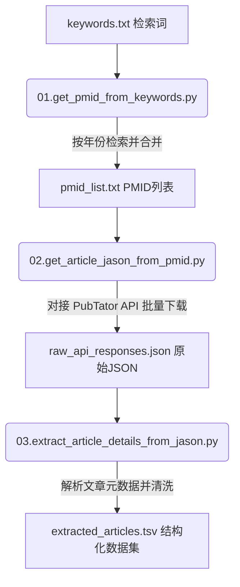
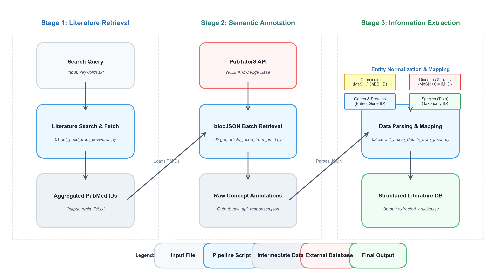

# Literature Mining Pipeline (生物医学文献挖掘与数据清洗流水线)

这是一个用于自动化检索、下载并解析生物医学文献的管道工具。该管道通过对接 NCBI PubMed 数据库和 PubTator 平台，实现基于关键字的大规模文献检索、元数据下载与结构化清洗。

## 🚀 项目结构与工作流

整个流水线由三个核心 Python 脚本组成，按顺序执行：



### 📝 工作流示意图 / Workflow Diagram



### 1. 文献检索与 ID 提取 (`01.get_pmid_from_keywords.py`)
* **功能**：基于本地 `keywords.txt` 中配置的检索词，调用 NCBI Entrez API 检索自 1979 年至今的所有相关文献。
* **特点**：
  * 支持断点续传（通过 `progress.json` 记录进度，防止网络中断或配额限制导致前功尽弃）。
  * 自动将各年份检索到的 PMID 去重并合并输出至 `pmid_list.txt`。

### 2. 文献元数据下载 (`02.get_article_jason_from_pmid.py`)
* **功能**：读取 `pmid_list.txt`，将 PMID 分批次（默认每批 10 个）向 PubTator API 发送请求，下载包含文献标题和摘要等元数据的 biocJSON 原始数据。
* **特点**：
  * 控制请求延迟（`REQUEST_DELAY = 0.5s`）避免被 API 阻断。
  * 保存为原始响应 JSON 文件 `raw_api_responses.json`。

### 3. 数据解析与结构化导出 (`03.extract_article_details_from_jason.py`)
* **功能**：解析 `raw_api_responses.json`，提取文献基本元数据，生成结构化的 TSV 文件。
* **提取字段**：
  * PMID
  * Journal (期刊)
  * Year (发表年份)
  * DOI
  * PMCID
  * Authors (作者列表)
  * Title (标题)
  * Abstract (摘要)

---

## 🛠️ 安装与配置

### 1. 安装依赖
克隆项目后，使用 pip 安装所需的第三方库：
```bash
pip install -r requirements.txt
```

### 2. 配置 NCBI 邮箱
在使用 Entrez API 前，请在 `01.get_pmid_from_keywords.py` 第 8 行配置您的有效邮箱地址（NCBI 要求）：
```python
Entrez.email = "your_email@example.com"
```

### 3. 创建检索词文件
在项目根目录下创建 `keywords.txt`，写入您需要检索的关键词组合。例如：
```text
(Salt stress OR Salinity) AND (Triticum aestivum OR Wheat)
```

---

## 📖 使用说明

按顺序运行以下脚本：

```bash
# 步骤 1: 检索文献并生成 PMID 列表
python 01.get_pmid_from_keywords.py

# 步骤 2: 下载文献元数据
python 02.get_article_jason_from_pmid.py

# 步骤 3: 提取结构化元数据表格
python 03.extract_article_details_from_jason.py
```

执行完成后，您将在当前目录下获得 `extracted_articles.tsv` 文件，可直接使用 Excel 或 Pandas 导入分析。
